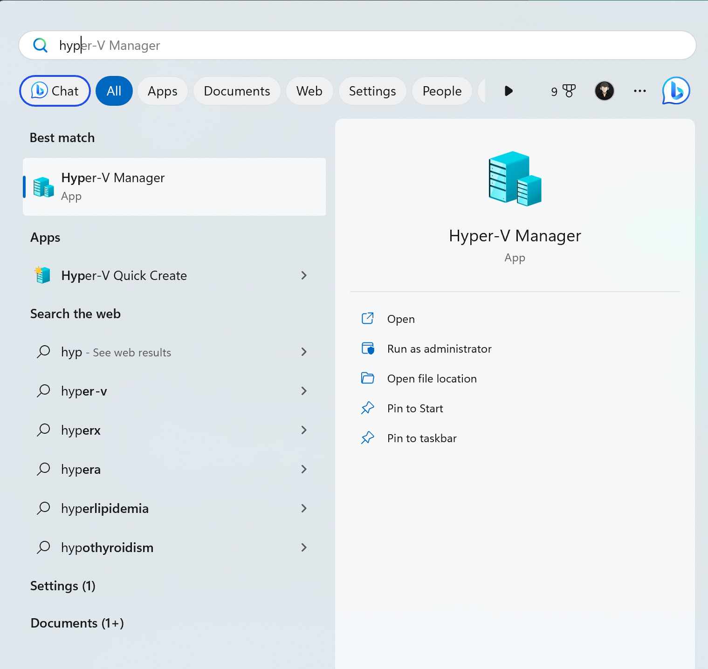
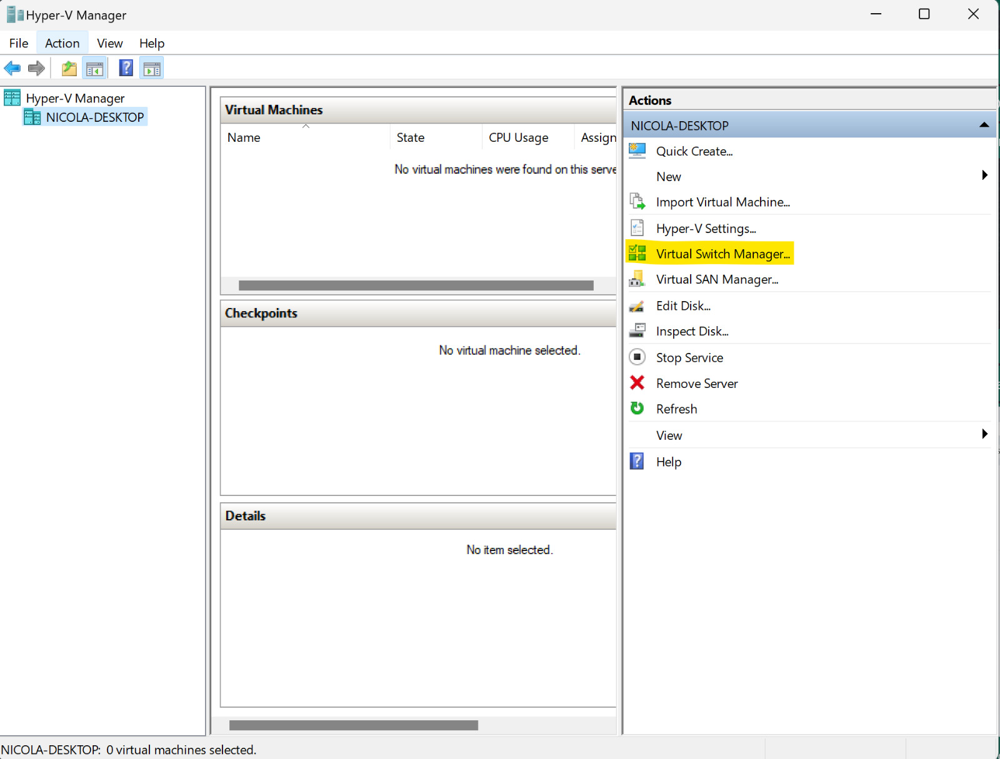
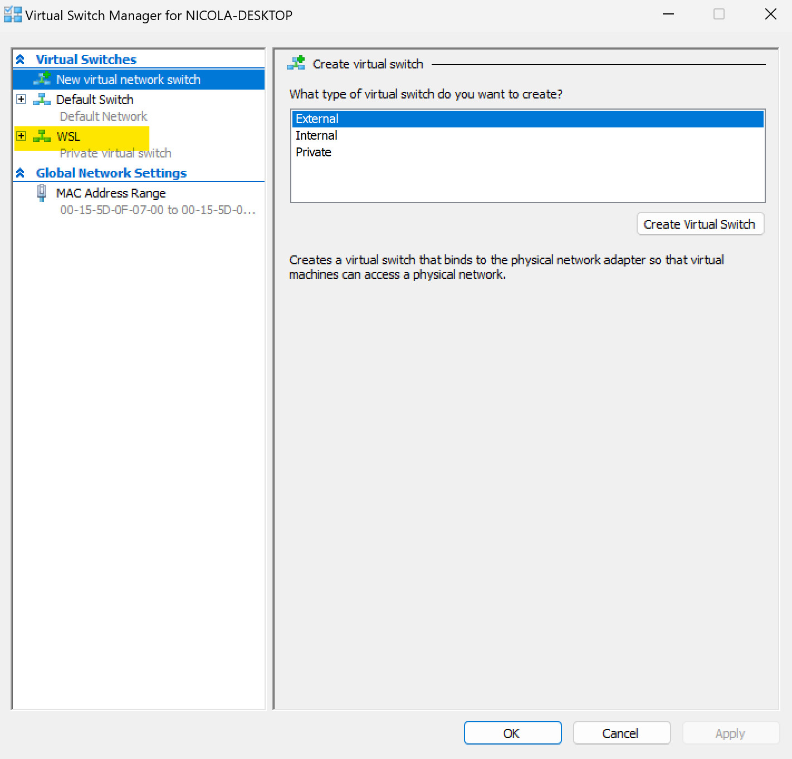
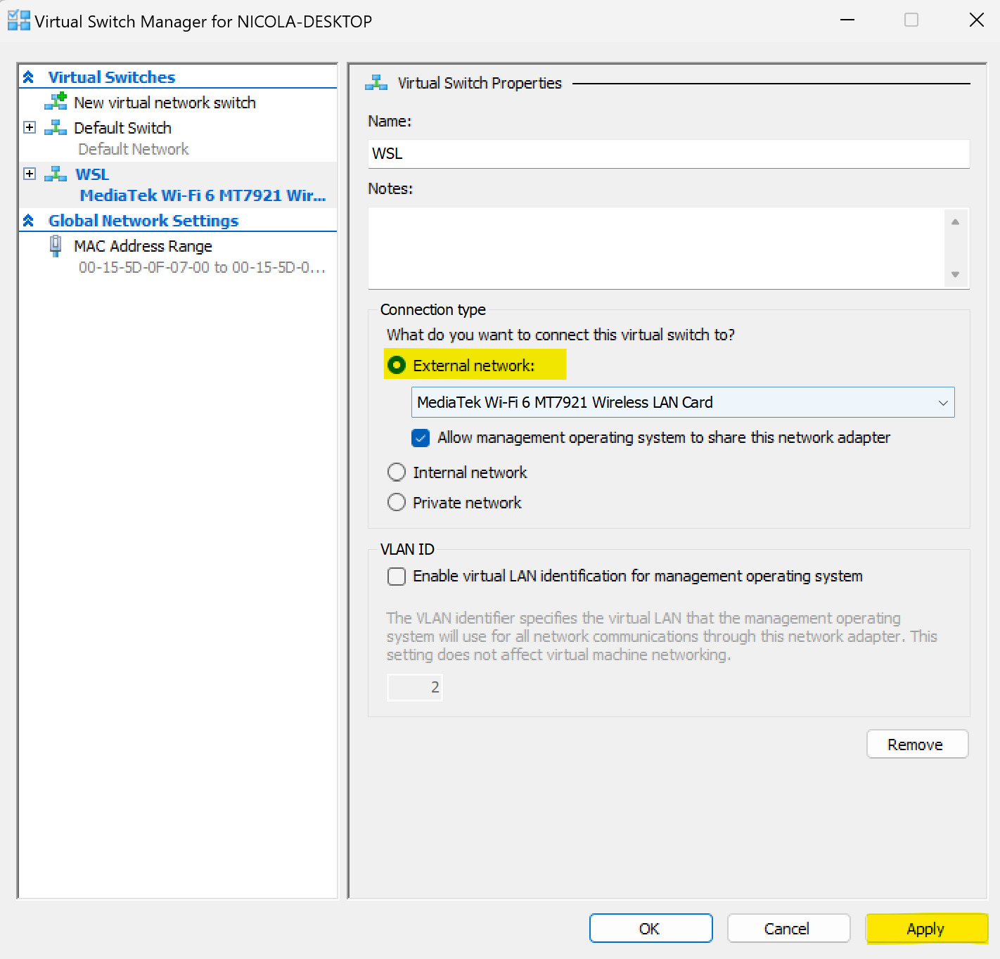
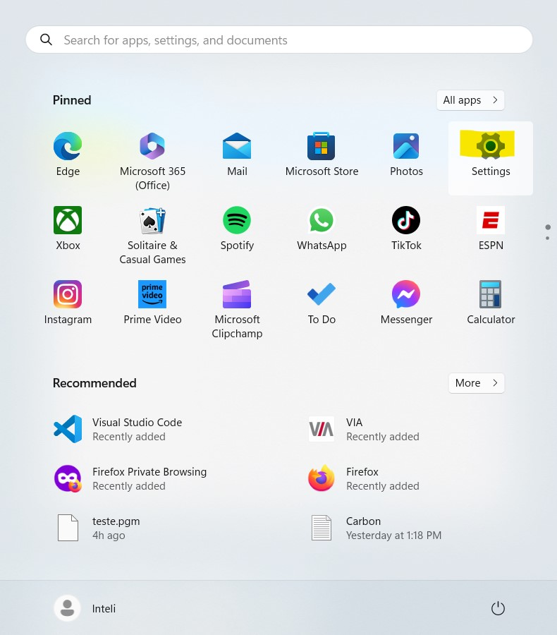
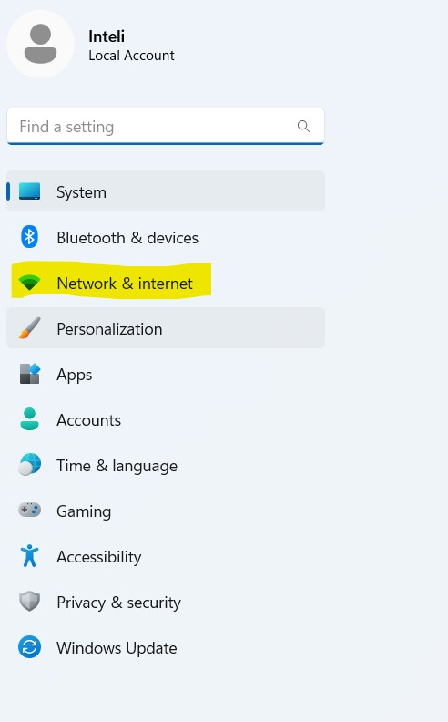
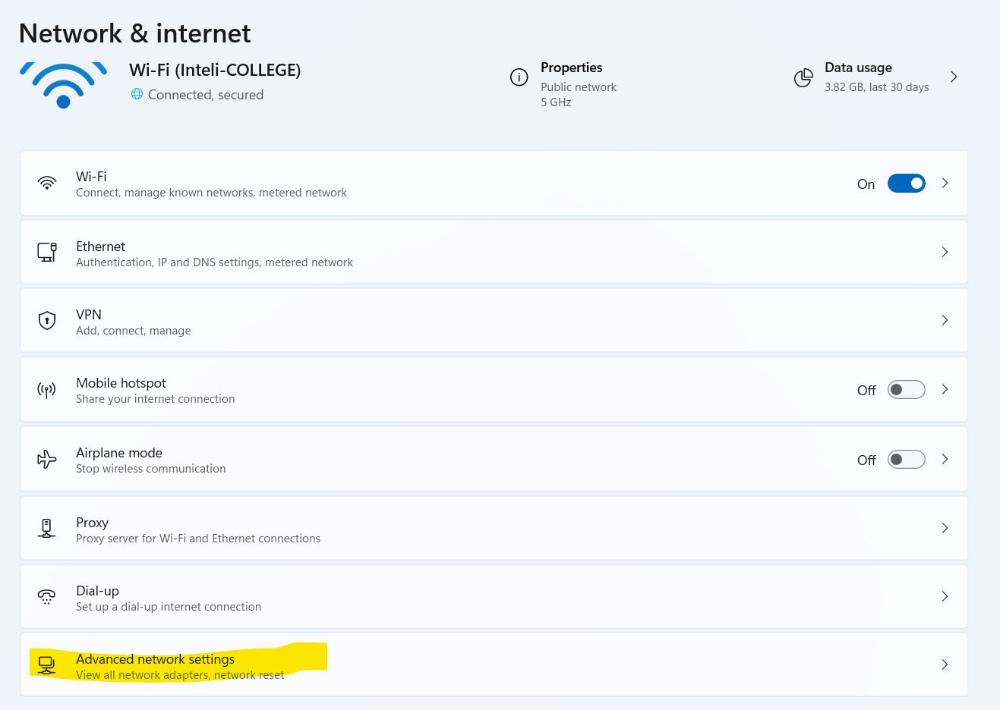
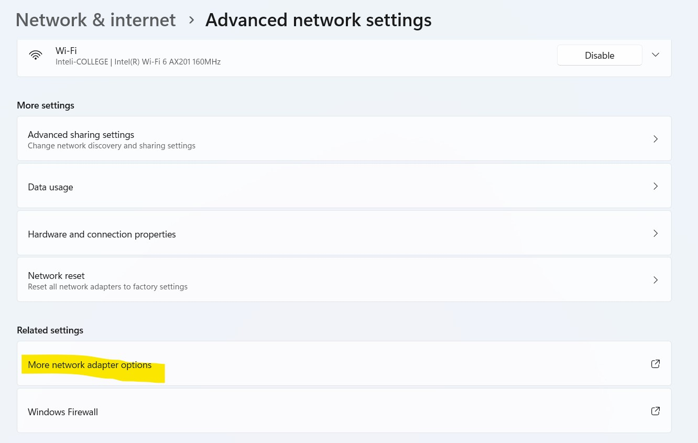

[Voltar para o repositório principal :house:](https://github.com/rmnicola/m6-ec-encontros.git)

# Integração de sistemas<!-- omit in toc -->

## Objetivos do encontro

## Conteúdo <!-- omit in toc -->

- [Mapear o TurtleBot World com SLAM](#mapear-o-turtlebot-world-com-slam)
  - [Mapeando](#mapeando)
  - [Salvando o mapa](#salvando-o-mapa)
  - [Abrir um mapa para navegação no RViz](#abrir-um-mapa-para-navegação-no-rviz)
    - [Resolvendo bug de importação do mapa](#resolvendo-bug-de-importação-do-mapa)
    - [Abrir o mapa em si](#abrir-o-mapa-em-si)
  - [Construindo e mapeando um mundo novo](#construindo-e-mapeando-um-mundo-novo)

## Configurando o WSL como Bridge

***Em construção***

Para configurar o WSL para usar rede em modo ponte, primeiro é necessário habilitar 







### Arrumando problema que pode aparecer com a rede





Após fazer as configurações acima, entre no WSL e rode:

```bash
sudo ip addr flush eth0
```

e 

```bash
sudo dhclient eth0
```

Ao rodar `ip a` você agora deve ver um ip dentro da subnet da sua rede local


## Setar o destino do robô manualmente no RViz

**Instale o Nav2**

```
sudo apt install ros-humble-navigation2
sudo apt install ros-humble-nav2-bringup
sudo apt install ros-humble-turtlebot3-gazebo

```

**Rodar exemplo do Nav2 com RViz**
```
source /opt/ros/humble/setup.bash
export TURTLEBOT3_MODEL=waffle
export GAZEBO_MODEL_PATH=$GAZEBO_MODEL_PATH:/opt/ros/humble/share/turtlebot3_gazebo/models
```
```
ros2 launch nav2_bringup tb3_simulation_launch.py headless:=False

```
No RViz, clique em "2D Point Estimate" e sete a posição inicial aproximada do robô no Gazebo. Então, clique em Navigation2 Goal e selecione o ponto desejado no mapa.

# Mapear o TurtleBot World com SLAM

## Mapeando
Em três terminais paralelos:

```
ros2 launch turtlebot3_gazebo turtlebot3_world.launch.py

```
(abre o Turtlebot World no Gazebo)

```
ros2 launch turtlebot3_cartographer cartographer.launch.py use_sim_time:=True

```
(abre o modo de mapeamento do RViz)

```
ros2 run turtlebot3_teleop teleop_keyboard
```
(abre o tópico de controle de movimentação do robô pelo teclado)

Então, movimente o robô por todo o mundo até que o mapa esteja bem delimitado no RViz (branco nas áreas livres e escuro nos obstáculos, sem manchas cinza no meio)


## Salvando o mapa
Na raiz do sistema operacional (~):
```
mkdir maps
cd maps
```
Rode o seguinte comando para salvar o mapa:
```
ros2 run nav2_map_server map_saver_cli -f <nome-do-mapa>
```
Se tudo deu certo, é para ter um arquivo "<nome-do-mapa>.pmg" e "<nome-do-mapa>.yaml" na pasta "maps".

## Abrir um mapa para navegação no RViz
### Resolvendo bug de importação do mapa
```
sudo apt update
```
```
sudo apt install ros-humble-rmw-cyclonedds-cpp
```
```
gedit ~/.bashrc
```
Adicione a seguinte linha:
```
export RMW_IMPLEMENTATION=rmw_cyclonedds_cpp
```
Depois, vá para o seguinte caminho:
```
cd /opt/ros/humble/share/turtlebot3_navigation2/param
```
Altere o arquivo "waffle.yaml" pelo sudo gedit ou vim. Substitua a linha robot_model_type por:
```
robot_model_type: "nav2_amcl::DifferentialMotionModel"
```
Não se esqueça de dar source no ~/.bashrc antes de continuar!

### Abrir o mapa em si

Em terminais paralelos, abra o Gazebo com o Turtlebot World e carregue o mapa gerado no RViz:

```
ros2 launch turtlebot3_gazebo turtlebot3_world.launch.py

```
Na pasta raiz (~):
```
ros2 launch turtlebot3_navigation2 navigation2.launch.py use_sim_time:=True map:=maps/<nome-do-mapa>.yaml

```
Feito é isso, é só setar o ponto inicial e movimentar o robô normalmente pela interface gráfica ou API em Python.

## Construindo e mapeando um mundo novo

1. Abra o Gazebo em mundo vazio com o seguinte comando:

```
ros2 launch turtlebot3_gazebo empty_world.launch.py
```
2. Na aba superior, clique em Edit > Building Editor
3. Construa o cenário desejado
4. Clique em File > Save
5. Clique em File > Exit Building Editor

O cenário criado irá aparecer no Gazebo. A partir daí, basta repetir os passos de mapeamento descritos anteriormente.